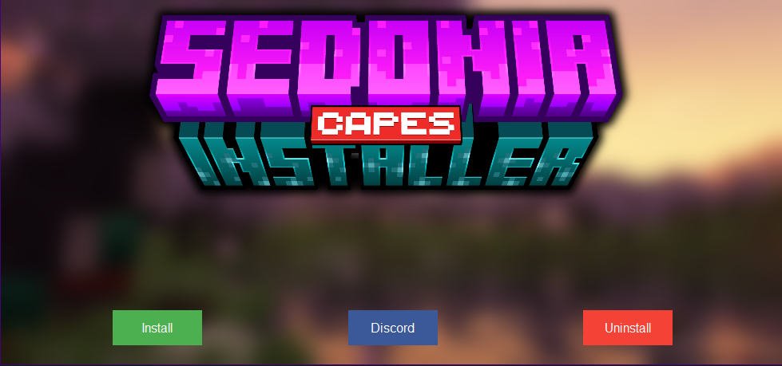

# Sedonia Capes Installer 

Welcome to the official repository for the Sedonia Capes Installer. We have made this project open-source to ensure transparency and to build trust within our community. Please feel free to review the code and contribute to the project.

## Table of Contents

- [Introduction](#introduction)
- [Features](#features)
- [Installation](#installation)
- [Usage](#usage)
- [Contributing](#contributing)
- [License](#license)
- [Contact](#contact)

## Introduction

The Sedonia Capes Installer allows users to easily manage and install capes for Minecraft. Recently, concerns have been raised about the security of our installer. In response, we have decided to publish the source code here to reassure our users that the installer is safe and secure.

## Features

- Simple and intuitive user interface
- Easily install and uninstall capes
- Direct link to our support Discord server
- Automated DNS cache flushing for immediate effect


## Installation

1. **Clone the repository:**
   ```sh
   git clone https://github.com/username/sedonia-capes-installer.git
   ```
2. **Navigate to the project directory:**
   ```sh
   cd sedonia-capes-installer
   ```
3. **Install the required dependencies:**
   ```sh
   pip install -r requirements.txt
   ```
4. **Run the installer:**
   ```sh
   python installer.py
   ```

## Usage

1. **Launch the Installer:** Run the script as an administrator to modify the `hosts` file.
2. **Install Capes:** Click on the "Install" button to add the necessary entries to your `hosts` file.
3. **Uninstall Capes:** Click on the "Uninstall" button to remove the entries from your `hosts` file.
4. **Join Our Community:** Click on the "Discord" button to join our support server and connect with other users.

## Contributing

We welcome contributions from the community! To contribute:

1. Fork the repository.
2. Create a new branch for your feature or bug fix.
3. Commit your changes and push your branch to your fork.
4. Open a pull request detailing your changes.

Please ensure your code follows our coding standards and includes appropriate documentation.

## License

This project is licensed under the MIT License. See the [LICENSE](LICENSE) file for details.

## Contact

If you have any questions, issues, or suggestions, feel free to join our [Discord server](https://discord.gg/VVYrFkV5wv) or contact us directly through GitHub.

Thank you for your trust and support!

Sincerely,
NightKikko, developper of Sedonia.
